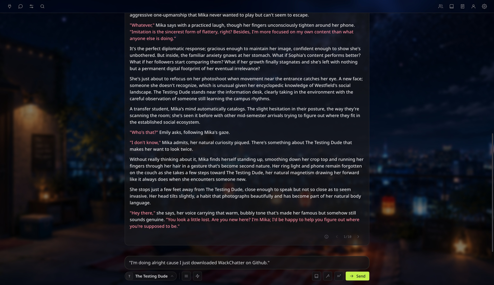
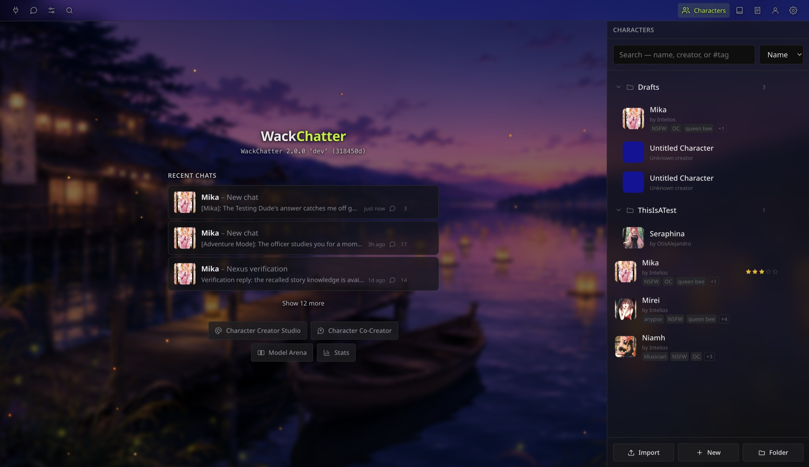
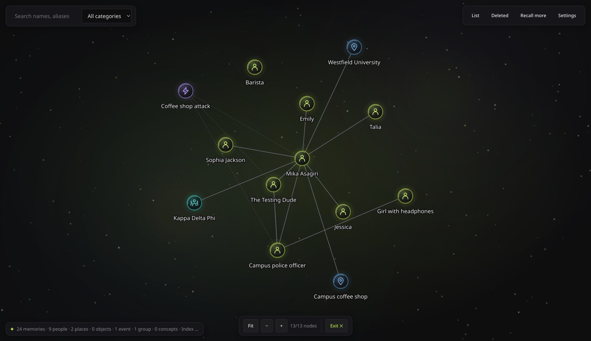

# Wack**Chatter**

A chat frontend for cloud LLMs with character cards, lorebooks, personas, and long-term story memory — all running locally in your browser. Uses your own API keys; nothing is sent anywhere except the model you pick.

Your existing character cards and presets from [SillyTavern](https://github.com/SillyTavern/SillyTavern) work here without conversion.



## Getting started

You'll need [Bun](https://bun.sh) installed — it takes a few seconds:

| | |
|---|---|
| **macOS / Linux** | `curl -fsSL https://bun.sh/install \| bash` or `brew install oven-sh/bun/bun` |
| **Windows** | `winget install Oven-sh.Bun` |

Then:

```sh
git clone https://github.com/Intelios/wackchatter.git
cd wackchatter
./start.sh          # Start.bat on Windows
```

That's it. The launcher handles dependencies, builds the app, and opens your browser. It does this on every launch (takes about a second), so there's never a stale build or a step you need to remember.

Once it's open, head to **Connection** in the left panel, add your API key and pick a model. Drop character cards (`.png` files) into `data/characters/` or import them from the Characters panel.

### Updating

```sh
./update.sh          # Update.bat on Windows
```

Your characters, chats, presets, and keys are all in `data/`, which git ignores — updates never touch your stuff.

## Features



**Chat** — Multiple chats per character. Swipes, branching, regenerate, continue, edit, delete, hide messages. Deleted chats go to a trash bin you can restore from.

**Characters** — SillyTavern-compatible V1/V2/V3 cards. Organise them into folders, import and export as PNG or JSON.

**Character Creator Studio** — A full card editor with structured fields for every part of a character: identity, description, personality, greetings, example dialogue, prompts, embedded lorebook, tags, and metadata. Shows live token counts per field and a budget meter against your preset's context limit, and lints your card in real time — catches missing fields, broken macros, duplicate greetings, placeholder avatars, and more.

**Character Co-Creator** — An AI design partner that helps you build characters through conversation. Describe a vague idea and it'll ask the right questions, draft fields, and propose openings. Everything it suggests appears as a labelled block you can file into the card with one click. Attach favourite cards from your library as style examples, and when you're happy, hand off to the Studio for final polish. The AI never edits the card directly — you curate what goes in.

**Prompt Manager** — Drag to reorder prompts, set depth injections, use marker prompts. Shows live token counts using a real tokenizer so you can see exactly how your context budget is being spent.

**Lorebooks** — Standalone World Info books and embedded character books, with a full activation engine (keyword matching, regex, budget, recursion, groups).

**Personas** — Create personas with avatars and bind them per-chat. Each message remembers which persona sent it.

**Guided Generations** — Steer replies with one-shot instructions or persistent per-chat guides, without cluttering the transcript.

**Memory Nexus** — The app tracks characters, places, events, and relationships as the story unfolds and recalls them when relevant. Uses a separate, cheaper model so it doesn't eat into your chat context. Includes a full-screen graph view for exploring what the story knows. You can also use classic summarisation, or turn memory off entirely — it's per-chat.



**Model Arena** — Blind side-by-side comparisons between models so you can figure out which one actually writes better for your use case.

**Connections** — Works with any OpenAI-compatible endpoint plus OpenRouter. API keys are stored server-side and never reach your browser.

**Themeable** — Custom backgrounds, glass effects, dialogue colours. The whole look is driven by a single token file.

**Portable library** — Your entire library (characters, chats, presets, lorebooks, personas, keys) lives in one folder. Move it to an external drive, a synced folder, or wherever you like — change the location from User Settings without restarting.

**Backups** — One-click backup of your whole library to a zip file from User Settings. Restore by unzipping anywhere and pointing the app at that folder.

## Your data

Everything lives in the `data/` folder by default. You can move it from **User Settings → Data location** — the app follows it with no restart needed.

If you put it in a cloud-synced folder (Dropbox, iCloud, OneDrive, etc.), just be aware:
- Run the app on **one machine at a time** to avoid database conflicts
- Your API keys travel with the library — they'll be in whatever service syncs the folder

### Backups

**User Settings → Backup** zips your entire library — characters, folders, chats, presets, personas, lorebooks, backgrounds, and deleted chats. API keys are left out by default (the zip won't have the same file permissions as the original), but you can include them if you want.

There's no restore button because there's nothing for it to do. The unzipped folder *is* a library — point the app at it and you're back.

## Environment variables

| Variable | What it does |
|---|---|
| `WC_PORT` | Override the port (default 8787) |
| `WC_DATA_DIR` | Pin the data folder and lock the in-app setting |
| `WC_NO_OPEN=1` | Don't open the browser on launch |

---

<details>
<summary><strong>For developers</strong></summary>

### Running in dev mode

```sh
bun install
bun run dev          # API on :8787 + Vite on :5173 (open :5173)
```

`bun run dev:server` and `bun run dev:client` run the halves separately. `bun run build` typechecks and builds. `bun run start` serves the production build.

### Testing

```sh
bun test             # full suite
bun run lint         # Biome
npx tsc --noEmit     # type check
```

### Project layout

```
server/    Bun server: files, DB, streaming proxy. Never builds a prompt.
shared/    Pure TypeScript, no I/O: prompt assembly, providers, World Info, chat types.
src/       React app.
```

Prompt assembly runs client-side (like SillyTavern) — the server only proxies requests. This keeps the server simple and means the prompt inspector shows the exact payload that was sent.

See [AGENTS.md](AGENTS.md) for detailed architecture and format rules.

</details>

## Acknowledgements

This app wouldn't exist without [SillyTavern](https://github.com/SillyTavern/SillyTavern). No code was taken from it, but its formats, design decisions, and years of community problem-solving taught me most of what I know about building a chat frontend. If you haven't tried it, you should.

Several SillyTavern extensions directly inspired features here:

- [Guided Generations](https://github.com/Samueras/GuidedGenerations-Extension) by Samueras — the idea of steering a reply without editing the transcript came from here
- [Moonlit Echoes](https://github.com/RivelleDays/SillyTavern-MoonlitEchoesTheme) by RivelleDays — a beautiful theme that influenced the visual direction
- [Smart Dialogue Colorizer](https://github.com/b4bysw0rld/SillyTavern-Smart-Dialogue-Colorizer) — avatar-based dialogue colouring, reimplemented natively

The Memory Nexus's local semantic search uses [BGE-small-en-v1.5](https://huggingface.co/BAAI/bge-small-en-v1.5) by BAAI, released under the MIT licence — small enough to vendor and run entirely in the browser without phoning home.

## Licence

[GNU Affero General Public License v3.0](LICENSE) — free to use, fork, and modify, but derivatives must stay open source and give credit.
